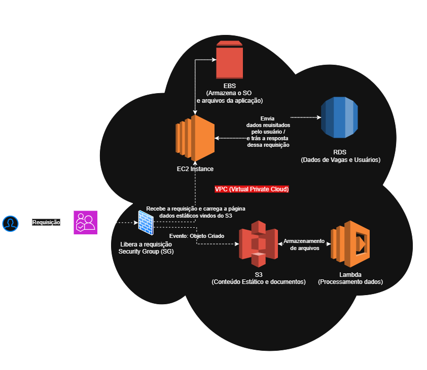

# Gerenciamento de Instâncias EC2 na AWS

**Descrição:**
Resolução do desafio de arquitetura AWS. Demonstração de gerenciamento EC2 para hospedar uma **Plataforma de Vagas de Emprego**.
O projeto integra **EC2, S3, RDS e Lambda** para desacoplar a lógica de negócio do processamento de arquivos (currículos e assets estáticos).

**Bootcamp:** [DIO Santander Code Girls 2025]

**Objetivo:**
Consolidar os conhecimentos em serviços AWS de computação e armazenamento, aplicando-os na modelagem de uma arquitetura de alto nível que usa **EC2** e **S3** como pilares.

---

## 📝 1. Diagrama da Arquitetura

O diagrama a seguir representa a infraestrutura de **três camadas** (Acesso, Aplicação, Persistência) para a Plataforma de Vagas.
Ele segue a diretriz de **desacoplamento**, utilizando o Lambda para o fluxo de eventos e o RDS para persistência.


```markdown

```

---

## 🔄 2. Fluxo da Aplicação e Interação de Serviços

O fluxo é dividido para otimizar recursos, separando a lógica de negócio do processamento de arquivos pesados.

### A. Fluxo Síncrono (Lógica de Negócio e Persistência)

Este fluxo é essencial para a navegação, login, e o salvamento de dados estruturados de vagas.

1. **Acesso e Computação:**
   A requisição é liberada pelo **Security Group (SG)** para a **EC2 Instance**. O código da aplicação (que reside no **EBS**) é executado.

2. **Persistência de Dados:**
   Para cadastrar uma vaga ou listar resultados, a **EC2** se comunica com o banco de dados **RDS** para salvar ou consultar os dados estruturados.

3. **Carga Estática:**
   O navegador do usuário carrega os ativos estáticos (CSS, JS) diretamente do **S3 (Conteúdo Estático)**.

### B. Fluxo Assíncrono (Upload e Processamento de Arquivo)

Este fluxo utiliza a arquitetura orientada a eventos para lidar com currículos e logotipos de forma escalável.

1. **Upload:**
   O Usuário faz o upload do Currículo (ou Logo) para o **S3 Bucket** de documentos.

2. **Gatilho de Evento:**
   O **S3** registra o recebimento do arquivo e dispara um **Evento**.

3. **Execução Serverless:**
   O evento aciona a **função Lambda** (Processamento de Dados).

4. **Processamento:**
   O **Lambda** executa tarefas (ex: extração de metadados) e salva esses metadados processados no **RDS** para consulta pela aplicação no EC2.

---

## 🧩 3. Detalhamento dos Componentes AWS (Insights)

| Componente                            | Função na Arquitetura                                                                                                                          | Conceitos e Insights Aplicados                                                                                                        |
| :------------------------------------ | :--------------------------------------------------------------------------------------------------------------------------------------------- | :------------------------------------------------------------------------------------------------------------------------------------ |
| **EC2 (Elastic Compute Cloud)**       | **Computação:** Servidor principal que executa o **Backend** e o **Frontend** da aplicação.                                                    | Focado na **lógica de negócios**, delegando persistência (RDS) e processamento de arquivos (Lambda).                                  |
| **EBS (Elastic Block Store)**         | **Persistência do Servidor:** O volume de disco que armazena o **Sistema Operacional (SO)** e o **código-fonte** da aplicação que roda no EC2. | Garante que o ambiente de execução da instância seja **persistente**.                                                                 |
| **S3 (Simple Storage Service)**       | **Armazenamento de Objeto:** Repositório escalável e durável para arquivos estáticos e documentos.                                             | Atua como um **gatilho de eventos** para processamento (Lambda), garantindo baixo custo e alta disponibilidade para arquivos grandes. |
| **RDS (Relational Database Service)** | **Dados Estruturados:** Banco de dados gerenciado (MySQL/PostgreSQL) para dados de vagas, candidaturas e credenciais de usuário.               | Migra a responsabilidade de gerenciamento, backup e manutenção do banco de dados para a AWS.                                          |
| **Lambda**                            | **Processamento Serverless:** Função acionada pelo S3 para manipular arquivos.                                                                 | Demonstra **Desacoplamento** e **Serverless**. Processa os uploads de forma econômica e escalável.                                    |

---

## 📌 4. Conclusão e Objetivos de Aprendizagem

Este projeto demonstra a capacidade de:

* **Aplicar Conceitos:** Utilização correta de EC2 e S3 em um cenário de aplicação.
* **Integrar Serviços:** Montar um fluxo coeso que usa **EC2** para lógica, **RDS** para dados, **EBS** para persistência do SO, e **Lambda/S3** para processamento de arquivos.
* **Documentar:** Criar um diagrama de arquitetura claro e uma documentação detalhada (`README.md`) sobre o papel de cada serviço.

---

## 🧠 Aprendizados e Reflexões Pessoais

Participar deste desafio foi uma excelente oportunidade para consolidar conhecimentos sobre **arquitetura em nuvem e serviços AWS**. Durante o desenvolvimento, aprimorei principalmente:

* **Compreensão prática da arquitetura em camadas**, aplicando conceitos de acesso, aplicação e persistência em um ambiente real.
* **Integração entre serviços AWS**, entendendo como EC2, S3, RDS e Lambda se complementam dentro de uma infraestrutura escalável e segura.
* **Importância do desacoplamento**, percebendo como o uso de funções serverless reduz a dependência entre componentes e melhora a eficiência.
* **Documentação técnica**, com foco em clareza e boas práticas de apresentação no `README.md` e na representação visual da arquitetura.

Além da parte técnica, este projeto reforçou o valor de **planejar a arquitetura antes da implementação** — garantindo um design coeso, sustentável e alinhado com boas práticas de cloud computing.

---
